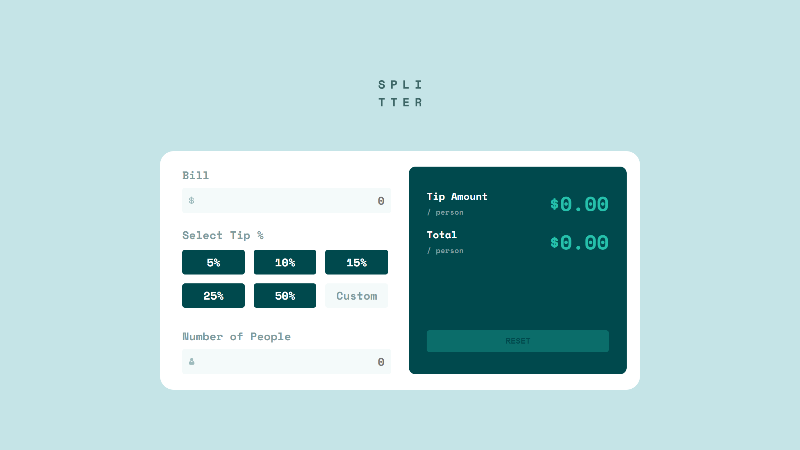

# Frontend Mentor - Tip calculator app solution

This is a solution to the [Tip calculator app challenge on Frontend Mentor](https://www.frontendmentor.io/challenges/tip-calculator-app-ugJNGbJUX). Frontend Mentor challenges help you improve your coding skills by building realistic projects.

## Table of contents

- [Overview](#overview)
  - [The challenge](#the-challenge)
  - [Screenshot](#screenshot)
  - [Links](#links)
- [My process](#my-process)
  - [Built with](#built-with)
  - [What I learned](#what-i-learned)
  - [Useful resources](#useful-resources)
- [Author](#author)

## Overview

### The challenge

Users should be able to:

- View the optimal layout for the app depending on their device's screen size
- See hover states for all interactive elements on the page
- Calculate the correct tip and total cost of the bill per person

### Screenshot



### Links

- Solution URL: [https://www.frontendmentor.io/solutions/tip-calculator-eXiLeV1R1w](https://www.frontendmentor.io/solutions/tip-calculator-eXiLeV1R1w)
- Live Site URL: [https://tip-calculator-omega-six.vercel.app/](https://tip-calculator-omega-six.vercel.app/)

## My process

### Built with

- Semantic HTML5 markup
- CSS custom properties
- Flexbox
- CSS Grid
- Mobile-first workflow
- Vanilla JS

### What I learned

I learnt how to change content of a tag without affecting embedded tag for example a span tag.

To see how you can add code snippets, see below:

```html
<p class="example1"><span>$</span> 50.00</h1>
<p class="example2">50<span>%</span></h1>

```

```js
const example1 = document.querySelector(".example1");
const example2 = document.querySelector(".example2");

console.log(example1.lastChild.nodeValue);
console.log(example2.firstChild.nodeValue);
```

### Useful resources

- [Change text without changing inner content](https://stackoverflow.com/questions/38741221/changing-text-of-div-without-changing-its-inner-tag-contents)

## Author

- Website - [Eseoghene Alli](https://esealli.github.io/)
- Frontend Mentor - [@EseAlli](https://www.frontendmentor.io/profile/EseAlli)
